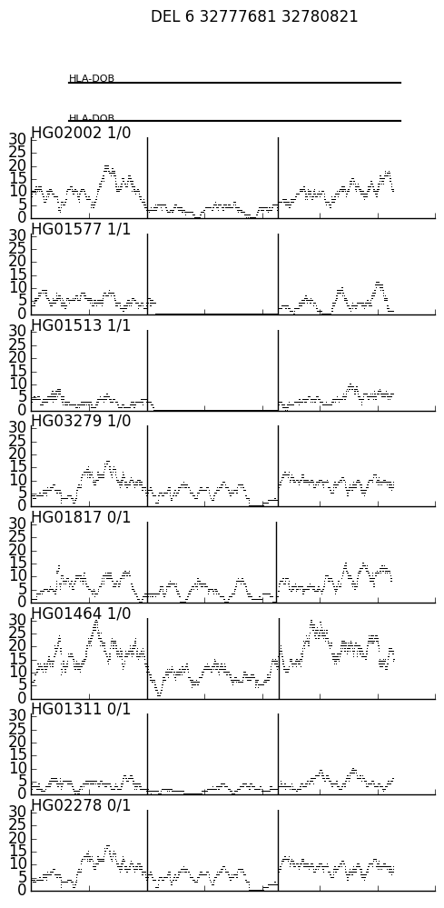

# SVView

A two-step process that can help visualize the coverage near a variant across multiple BAMs.

Step 1: Create a coverage file for each variant in a VCF.  (NOTE: use [GQT](https://github.com/ryanlayer/gqt), [bcftools](https://github.com/samtools/bcftools), [bedtools](https://github.com/arq5x/bedtools2) etc to filter your full VCF down to a more interesting/managable subset.)

    $ bcftools view test/test.vcf.gz | ./sv_depth.py test/test.ped 1000
    
`sv_depth.py` creates a covrage file  "var_ID.txt" for each SV in the VCF, where ID is the variant ID (3rd column of the variant record).  In this case, `test/test.vcf.gz` has two variants, `DEL_pindel_18715` and  `UW_VH_5456`, and so it creates `var_DEL_pindel_18715.txt` and `var_UW_VH_5456.txt`.  The two parameters to `sv_depth.py` are the ped file (where the 8th column is a path to the BAM files) and a the distance up and down stream of the the SV that is inclued in the coverage file.

Step 2: Visualize these coverages with `spark.py`, which takes an exome file, a map from transcrip to gene name, and an ouputfile.
  
    $ cat var_DEL_pindel_18715.txt \
        | ./spark.py \
            -e data/h37_ensemble_exons.bed.gz \
            -n data/h37_ensemble_exons.togenename.txt \
            -o var_DEL_pindel_18715.png

    $ cat var_UW_VH_5456.txt \
        | ./spark.py \
            -e data/h37_ensemble_exons.bed.gz \
            -n data/h37_ensemble_exons.togenename.txt \
            -o var_UW_VH_5456.png

